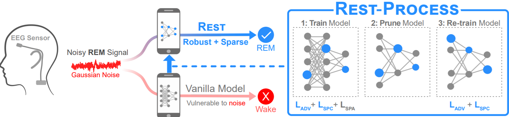

# REST : Robust and Efficient Sleep Monitoring in the Wild
Code accompanying WWW 2020 paper.

## Contents
1. [Motivation](#motivation)
2. [Setup](#requirements)
3. [Experiments](#experiments)

## Motivation
In the paper, we identify the following key challenges for deploying deep neural network for sleep staging in the wild.
The DNN needs to be:- 

    C1. Robust to noise in input data.
  
    C2. Energy Efficient. 
  
To tackle these challenges, we propose a novel framework - REST that builds noise robustness through adversarial training and spectral regularization and energy efficiency through sparsity regularization. The method is summarized below 

<p align="center">
  
</p>

(from left) When a noisy EEG signal belonging to the REM (rapid eye movement) sleep stage enters a traditional neural network which is vulnerable to noise, it gets wrongly classified as a Wake sleep stage. On the other hand, the same signal is correctly classified as the REM sleep stage by the REST model which is both robust and sparse. (From right) REST is a three step process involving (1) training the model with adversarial training,  spectral regularization and sparsity regularization (2) pruning the model and (3) re-training the compact model.


## Requirements
This project is written in python 3.6.6

We suggest recreating the experimental environment using [Anaconda](https://www.anaconda.com/distribution/) through the following steps.

1. Clone the project

    ```git clone https://github.com/sleepstagingrest/REST.git```

2. Install the appropriate version for Anaconda from here - https://www.anaconda.com/distribution/

3. Create a new conda environment named "rest" and install requirements.

    - ```conda create -n rest python=3.6.6```
    - ```conda activate rest```
    - ```pip install --user --requirement requirements.txt```

4. Install advertorch

    ```pip install -e advertorch```

## Experiments

For demo, we use the Sleep-EDF dataset

1. Prepare dataset
    - Follow instructions within ```data/physionet``` to prepare Sleep-EDF dataset
    
2. To evaluate **Sors** Model on **Physionet**, execute the following steps within ```experiments.py```
    - Ensure correct config file is specified : ```args=args_sors_physionet```
    - Specify a logging comment : ```args['logging_comment'] = Sors_Physionet```
    - Specify the correct experiment : ```ex.bt()```

3. To evaluate **REST(A+S)** model on **Physionet**, execute the following steps within ```experiments.py```
    - Ensure correct config file is specified : ```args=args_sors_physionet```
    - Specify a logging comment : ```args['logging_comment'] = Rest_Physionet```
    - Specify the correct experiment : ```ex.atc_ortho()```


4. Each experiment in steps 2,3 produces a log file which can be viewed to get correct result.
    - The path of the file is ```logs1/[dataset]_[model]/['logging_comment']``` where
        - dataset is ```physionet```
        - Model is ```Sors```
        - logging_comment is ```Sors_Physionet``` or ```Rest_Physionet``` depending on experiment

## License
This code is released under the MIT License (refer to the LICENSE file for details).


